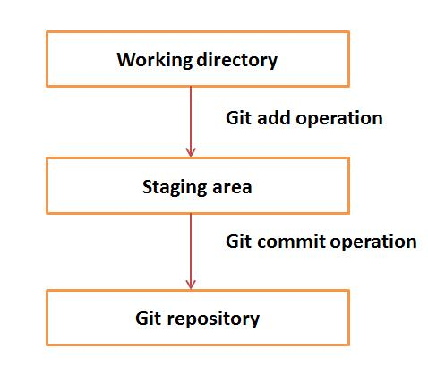

## Git 基本概念

---

请参照[官方网站](https://git-scm.com/book/zh/v2)的详细介绍，网站比较单调，没啥花哨的地方。

---

### 目录

- [Git 基本概念](#git-基本概念)
  - [目录](#目录)
  - [１．版本控制系统](#１版本控制系统)
  - [２．分布式版本控制系统](#２分布式版本控制系统)
  - [３．Git 的优势](#３git-的优势)
    - [3.1 免费且开源](#31-免费且开源)
    - [3.2 快捷轻便](#32-快捷轻便)
    - [3.3 默认的备份](#33-默认的备份)
    - [3.4 安全](#34-安全)
    - [3.5 硬件资源要求不高](#35-硬件资源要求不高)
    - [3.6 更简单的分支管理](#36-更简单的分支管理)
  - [４．分布式存储系统中的术语](#４分布式存储系统中的术语)

---

### １．版本控制系统


版本控制系统是一种帮助软件开发者实现团队合作和历史版本维护的软件，一个版本控制系统应具备以下列出的这几个基本功能：


- 允许开发者并发工作；
- 不允许一个开发者覆写另一个开发者的修改；
- 保存所有版本历史。


版本控制系统可以分为如下两类：


- 集中式版本控制系统；
- 去中心式（分布式）版本控制系统。


Git 是一种分布式版本控制系统。在这一章里，我们将着重介绍分布式版本控制系统，特别是重点介绍 Git。


### ２．分布式版本控制系统


集中式版本控制系统是用一个中央服务器存储所有文档并在此中央服务器上实现团队合作，此种系统的主要弊端在于中央服务器可能发生的单点故障：如果中央服务器不幸宕机一小时，那么这一小时内就完全不能合作开发了。此种弊端能导致的最糟糕的情况是，如果中央服务器在成功备份之前完全崩溃，那么中央服务器中所存储的此项目的所有历史版本都将丢失。这时，就该考虑一下分布式的版本控制系统了。


分布式版本控制系统中的客户端不仅可以查验项目目录的最新快照，而且可以镜像整个仓库。如果服务器宕掉了，任何一个客户端存储的仓库镜像都能作为备份用来恢复。每一次查验都会形成一个仓库的完整备份。Git 并不依赖于中央服务器，这样开发者就能在离线情况下也进行各种操作。开发者能够在离线情况下进行提交、创建分支、查看日志等操作，只有要公布自己的变更或者获取最新的变更版本时才需要连接网络。


### ３．Git 的优势


#### 3.1 免费且开源


Git 是遵循 GPL 开源许可的发行软件，在整个互联网上都可以免费获取。你可以用 Git 来管理财产相关工程而不用花一分钱，而且因为它是开源的，你还可以下载源码按自己的需求对它进行改造。


#### 3.2 快捷轻便


因为绝大多数操作都可以在本地完成，这让速度得到了很大的提升。Git 并不依赖中央服务器，这就是为什么没有必要每个操作都得和远端服务器交互的原因。Git 的核心部分是用 C 语言写成的，这避免了使用更高级语言造成的运行时间上的浪费。尽管 Git 镜像了整个仓库，客户端的数据量仍然很小，这很好地说明了 Git 在客户端压缩存储数据的效率有多高。


#### 3.3 默认的备份


当存在很多份镜像复制时，数据丢失的可能性就大大减小了。任何客户端上的数据都是仓库的镜像，这些数据在系统崩溃或硬盘损毁时都可以用来恢复。


#### 3.4 安全


Git 使用一种叫做安全散列算法（SHA1）的加密方法去命名并识别数据库中的对象。每个文件和每次提交都会加上校验码供验证，每次取出数据也都得使用校验码校验。这意味着在不了解 Git 的情况下，开发者不可能成功进行修改文件数据、提交信息或者其他会改变 Git 项目数据库的操作。


#### 3.5 硬件资源要求不高


在使用集中式版本控制系统时，需要的中央服务器必须足够强大以支撑团队所有成员的请求。对于小型开发团队来说，这个问题不难解决，但是如果团队规模不断增大，服务器的硬件限制就会成为瓶颈。在分布式版本控制系统中，开发者只有在推出（push）或拉取（pull）修改时才需要连接服务器，所有负担较重的工作都在客户端这边完成，所以服务器的硬件条件就可以从简规划。


#### 3.6 更简单的分支管理


集中式版本控制系统使用一种简单的复制机能，如果我们在其中创建一个分支，那么该分支会将项目所有代码拷贝在新的分支中，此方法效率不高且颇费时间，而且在集中式版本控制系统中删除和合并分支都很复杂且耗时长。但是分支管理在 Git 中容易多了，在 Git 中创建、删除和合并分支均只会花费很少的时间。


### ４．分布式存储系统中的术语


- **本地库 （Local Repository）**

>所有版本控制系统工具都会提供个人工作空间，在其中对复制下来的工程项目进行操作，开发者在自己的个人工作空间中做出改动然后提交，这些改动也就成为了项目仓库的一部分。Git 更进一步为开发者们提供整个仓库的私人复制本，开发者们可以对这个仓库进行任何操作，比如增加文件、删除文件、移动文件、提交修改等。


- **工作目录、暂存区或索引**

（Working Directory and Staging Area or Index）


> 工作目录即文档被拉取或创建后所在的目录位置。在集中式系统中，开发者们通常做出修改然后将更改项直接提交给仓库。Git 不同，Git 不会追踪每次每个被修改的文档，不论何时你提交了一个操作，Git 都会搜寻暂存区现有的文档，不是所有被修改的文档而是只有暂存区现存的文档会被纳入考虑。


> 让我们来看看 Git 的基本工作流：


  - 第一步 —— 在工作目录下修改一个文档；
  - 第二部 —— 将此文档加入暂存区；
  - 第三步 —— 进行提交操作，此操作从暂存区将文档移入本地库中，完成推出（push）的操作后，此变动就永久保存在了 Git 仓库里了。




如果你修改了两个文件，`sort.c` 和 `search.c`，并且你想为这两次修改分别进行两次提交，这时，你可以先将一个文件添加进暂存区再提交，然后按这种方式处理下一个文件。操作示例如下，`-m` 后面的参数为本次提交的说明：


```
# First commit[jerry@CentOS ~]$ git add sort.c# adds file to the staging area[jerry@CentOS ~]$ git commit –m “Added sort operation”# Second commit[jerry@CentOS ~]$ git add search.c# adds file to the staging area[jerry@CentOS ~]$ git commit –m “Added search operation”
```


- **二进制大型对象（Blobs）**


> `Blob` 是 Binary Large Object （二进制大型对象）的缩写，每个版本的文件都以 `blob` 类型呈现。`blob` 包含文件的所有数据，但唯独没有文件的元数据。这是一种二进制文件，在 Git 数据库中，它以“文件的安全散列哈希”闻名。在 Git 中，文件并不是按名字而是按内容来处理的。


- **树（Trees）**


> 树是一种对象，代表一个目录。它包含 `blob` 类型的文件和其他子目录，一棵树即是一个存储指向 `blob` 的索引或者被称为树对象的安全散列哈希的二进制文件。


- **提交操作（Commits）**


> 提交操作维持着仓库的当前状态，一个提交也会被安全散列哈希指名。你可以将提交操作对象看作链表的一个节点，每个提交操作对象都有一个指向父提交节点的指针。从给定的一个提交中，你能通过查找父指针去回溯查看提交的历史。如果一个提交有不止一个父提交，那么此提交是通过两个分支合并来创建的。


- **分支（Branches）**


> 分支用于创建发开的另一线路。默认情况下，Git 有一个 **master** 分支，此分支如同另一种版本管理工具 Subversion 即 SVN 中的树干 **trunk**。通常来说，一个分支用于一个新功能的开发，一旦新功能开发完成，就将这个分支合并到 **master** 上，然后删除这个分支。每个分支都可由 `HEAD` 指示，`HEAD` 在不指定的情况下总是指向分支的最新一次提交状态。不论何时你完成一次提交操作，`HEAD` 都会以最新的提交操作来更新自己。


- **标签（Tags）**


> 标签能给仓库中某个特定版本分配一个有意义的名字。标签和分支很相似，不同的地方在于标签是不变动的。这意味着，标签是一种没人去修改的分支。一旦为某个特定提交操作创造了一个标签，即使你再完成一次新的提交操作，它也不会更新。一般开发者会给产品的发行版本创建标签。


- **克隆（Clone）**


> 克隆操作会给仓库创建一个实例。克隆不仅能检视当前工作的副本，而且能镜像整个仓库。用户能在本地仓库上完成各种操作，只有在仓库实例同步时才需要连接网络。


- **拉取（Pull）**


> 拉取操作将远端仓库实例的变动拷贝到本地，此操作用于两个仓库实例的同步中。`pull` 操作与 SVN 中的 `update` 操作效果相同。


- **推出（Push）**


> 推出操作将本地的仓库实例发生的变动拷贝到远端仓库中，此操作常用于将对本地做的改动永久存储到 Git 仓库中。`push` 操作与 SVN 中的 `commit` 操作效果相同。


- **HEAD**


> `HEAD` 是一个指针，它永远指向分支中的最新提交内容。不论何时你完成一次提交，`HEAD` 总会随着最近的一次提交而更新。分支的 `heads` 存储在 `.git/refs/heads/` 目录下。


```
[jerry@CentOS ~]$ ls -1 .git/refs/heads/master[jerry@CentOS ~]$ cat .git/refs/heads/master570837e7d58fa4bccd86cb575d884502188b0c49
```


- **修订（Revision）**


> 修订即是源代码的改版，在 Git 中修订由提交体现，而这些提交操作则由安全散列算法认定识别。


- **URL**


> URL 表示 Git 仓库的位置，该项内容存储在 Git 的设定文件 `.git\config` 里。


```
[gituser@CentOS ~]$ cat .git/config[core]repositoryformatversion = 0filemode = truebare = falselogallrefupdates = true[remote "origin"]url = gituser@git.server.com:project.gitfetch = +refs/heads/*:refs/remotes/origin/*
```

