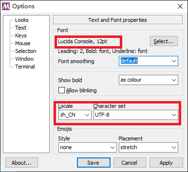

# GIT 软件安装

## 1. Git客户端软件安装

官方网站：

- [Git - Book (git-scm.com)](https://git-scm.com/book/zh/v2)

### 1.1 GIT for Windows

- 启动命令提示符、或者是 **PowerShell** ， 输入如下命令：

  ```bash
  winget install --id Git.Git -e --source winget
  ```

  如果电脑上尚未安装 winget ，可以通过[官方网站](https://git-scm.com/download/win)下载安装。
  
  Git的代码在[Github](https://github.com/git-for-windows/git)上是公开的，你可以下载代码，然后自己编译。
  
- 也可以官网直接下载安装，不做详细介绍。

#### 1.1.1 Git Bash配置

默认安装的话，Git Bash的字体、界面都显得很小，看起来很不舒适。启动 Git Bash 后，点击应用的系统菜单，选择**Option**项目。

- 画面调整

  

- 字体调整

  

#### 1.1.2 Git GUI配置

在没有在实际的Git仓库被克隆之前，启动Git GUI无法看到Option项目，所以其配置需要等正常执行可控之后，在相应目录中点击鼠标右键，选择Git GUI之后，才可能进行Option设置。

- 菜单Edit选择Option子菜单项目：

  

### 1.2 GIT for Linux

请参照官网介绍：https://git-scm.com/download/linux

- Debian、Ubuntu、UOS等

  ```bash
  # sudo apt install git
  sudo apt install git-all
  ```

- Fedora

  ```bash
  sudo yum install git-all
  ```

### 1.3 Git for Mac

- 安装指令：

  ```bash
  # Download
  http://git-scm.com/download/mac
  
  # Install
  http://mac.github.com/
  ```

## 2. Git 环境设置

所有指令，在Linux环境，直接在终端内输入后续指令；Windows的话，在资源管理器的任意位置点击鼠标邮件，选择Git Bash菜单项目即可输入后续指令，如果想要在命令提示符里面输入Git指令，需要重新启动电脑。

- 全局设置

  ```bash
  git config --global user.name "Administrator"
  git config --global user.email "admin@example.com"
  ```

  把用户名（`"Administrator"`）及邮件地址（`"admin@example.com"`），替换为自己的用户名、邮件地址。

  ※Windows环境下，Git的安装路径虽然被加入系统环境变量，但是需要重启电脑才能生效，所以最好是启动`Git Bash`执行Git的相关指令。

- HTTPS认证设置

  如果远程克隆https的数据失败，出现如下错误：

  ```bash
  fatal: 无法访问 'https://gitlab.liu.com/liu-group/test1.git/'：server certificate verification failed. CAfile: none CRLfile: none
  ```

  可能是没有正确安装CA证书，执行如下指令即可：

  ```bash
  sudo apt install --reinstall ca-certificates
  ```

- 自建Gitlab服务器

  １．自建Gitlab服务器的证书是不被认可的，如果你足够信任该服务器，可以在`git clone`执行之前，先执行如下指令设置花茎变量：

  ```bash
  export GIT_SSL_NO_VERIFY=1
  ```

  一旦关闭终端，下次的话，仍然需要输入该指令。并且该指令只能在Git bash中执行，无法在命令提示符中执行。

  ２．如果想要一劳永逸的解决该问题，可是直接输入配置命令：

  ```bash
  git config --global http.sslVerify false
  ```

  这样等于少了一道SSL防护，虽然没有解决凭证问题，等于凭证放弃不管，对于不熟悉的服务器，不建议这么做。

## 3. 配置SSH密钥

### 3.1 生成SSH密钥

1. Linux环境，打开一个终端。

   如果是Windows环境，打开`Git bash`，能够自动找到`ssh-keygen`的路径。

   ※一般来说，Git默认安装的话，`ssh-keygen.exe`存在于`C:\Program Files\Git\usr\bin\`目录下。

2. 键入`ssh-keygen -t`后跟键类型和可选注释。

   键类型：例如，对于 ED25519

   注释：包含在`.pub`创建的文件中。您可能希望使用电子邮件地址发表评论。

   ```bash
   $ ssh-keygen -t ed25519 -C "<zhijun_liu@hotmail.com>"
   ```

   ※Windows环境下，Git默认安装的话，ssh-keygen.exe存在于`C:\Program Files\Git\usr\bin\`目录下，不过使用`Git bash`的话，会自动找到该路径。

3. 显示如下信息：

   ```bash
   $ ssh-keygen -t ed25519 -C "<zhijun_liu@hotmail.com>"
   Generating public/private ed25519 key pair.
   Enter file in which to save the key (/c/Users/liu/.ssh/id_ed25519):
   ```

   ※接受建议的文件名和目录，除非您正在生成[部署密钥](../user/project/deploy_keys/index.md) 或想要保存在存储其他密钥的特定目录中。  
   ※您还可以将 SSH 密钥对专用于[特定主机](#configure-ssh-to-point-to-a-different-directory)。

4. 指定密码：

   ```bash
   Created directory '/c/Users/liu/.ssh'.
   Enter passphrase (empty for no passphrase):
   Enter same passphrase again:
   ```

   ※尽量不要在此处输入密码，否则后续会非常麻烦，每次都要确认密码，尤其是Git GUI here。如果是Git Bash here的话，还可以通过目录设置，无需输入口令。感觉是软件还存在问题，尚需完善（更多的感觉是Git GUI here根本就没有用力，用起来怎么都是不舒服）。

5. 显示密钥创建信息：

   **Linux**：

   ```bash
   ...
   Your identification has been saved in /home/liu/.ssh/id_ed25519
   Your public key has been saved in /home/liu/.ssh/id_ed25519.pub
   The key fingerprint is:
   SHA256:/Qw+5cTtF3NJCuGadttyQWT2pgr9ScGATe4ak3Sl/1I <comment>
   The key's randomart image is:
   +--[ED25519 256]--+
   ...
   ```

   **Windows**：

   ```bash
   ...
   Your identification has been saved in /c/Users/liu/.ssh/id_ed25519
   Your public key has been saved in /c/Users/liu/.ssh/id_ed25519.pub
   The key fingerprint is:
   SHA256:T1QmnDS7oEThv8lcWvPCvyJZMrd06f15646xq28NTac <comment>
   The key's randomart image is:
   +--[ED25519 256]--+
   ...
   ```

   ※Windows下，显示的输出路径看起来有错误，实际上是没有问题的，属于Linux类似的格式。

6. 查看公钥内容：

   公钥内容拷贝后，需要更新到Gitlab服务器，这样就可以通过SSH来操作数据。

   **Linux**：

   ```bash
   $ nano /home/<username>/.ssh/id_ed25519.pub
   ```

   **Windows**：

   ```bash
   $ notepad /c/Users/<username>/.ssh/id_ed25519.pub
   ```
   
   ※`<username>`是系统登录用户名。

### 3.2 配置私钥目录

如果密钥生成的时候，设置了密码的话，需要用如下指令把本地目录加入Git的配置文件。  
※如果密钥没有口令的话，则没有这个必要，可以跳过这一步。

- Linux环境：

  ```bash
  eval $(ssh-agent -s)
  ## ssh-add <directory to private SSH key>
  ssh-add /home/liu/.ssh/id_ed25519
  ```

- Windows环境：

  ```bash
  eval $(ssh-agent -s)
  ## ssh-add <directory to private SSH key>
  ssh-add c:/Users/<username>/.ssh/id_ed25519
  ```
  
  ※`<username>`是系统登录用户名。

只有如上追加了目录之后，该目录里面的数据在克隆、推送的时候，才不需要输入口令，否则必须输入口令。

### 3.3 SSH公钥添加到 GitLab 帐户 

要将 SSH 与 GitLab 一起使用，请将您的公钥复制到您的 GitLab 帐户。

1. 复制您的公钥文件的内容。
2. 登录 GitLab。
3. 在右上角，选择您的头像。
4. 选择**首选项**。
5. 从左侧边栏中，选择**SSH Keys**。
6. 在“**密钥**”框中，粘贴您的公钥的内容。如果您手动复制了密钥，请确保复制整个密钥，该密钥以`ssh-ed25519`or开头`ssh-rsa`，并且可能以注释结尾。
7. 在**标题**文本框中，输入描述，例如*Work Laptop*或 *Home Workstation*。
8. 可选的。在“**到期**日期”框中，选择到期日期。[（在GitLab 12.9](https://gitlab.com/gitlab-org/gitlab/-/issues/36243)中引入。）到期日期仅供参考，不会阻止您使用密钥。但是，管理员可以查看到期日期并将其用作[删除密钥](../user/admin_area/credentials_inventory.md#delete-a-users-ssh-key)时的指导。
   - GitLab 每天 02:00 AM UTC 检查所有 SSH 密钥。它会通过电子邮件发送在当前日期到期的所有 SSH 密钥的到期通知。（在 GitLab 13.11 中[引入。）](https://gitlab.com/gitlab-org/gitlab/-/issues/322637)
   - GitLab 每天 01:00 AM UTC 检查所有 SSH 密钥。它会通过电子邮件发送所有计划在 7 天后到期的 SSH 密钥的到期通知。（在 GitLab 13.11 中[引入。）](https://gitlab.com/gitlab-org/gitlab/-/issues/322637)
9. 选择**添加键**。


### 3.4 验证是否连接正常

1. 输入如下指令：

   ```bash
   ssh -T git@gitlab.liu.com
   ssh -T git@192.168.114.146
   ```

2. 显示验证要求：

   如果这是您第一次连接，您应该验证 GitLab 主机的真实性。如果您看到如下消息：

   ```bash
   The authenticity of host 'gitlab.example.com (35.231.145.151)' can't be established.
   ECDSA key fingerprint is SHA256:HbW3g8zUjNSksFbqTiUWPWg2Bq1x8xdGUrliXFzSnUw.
   Are you sure you want to continue connecting (yes/no)? yes
   Warning: Permanently added 'gitlab.liu.com' (ECDSA) to the list of known hosts.
   ```

   键入`yes`并按 Enter，然后输入相应口令：

   ```bash
   liu@debian:~/.ssh$ ssh -T git@gitlab.liu.com
   The authenticity of host 'gitlab.liu.com (192.168.114.146)' can't be established.
   ECDSA key fingerprint is SHA256:3RlEhtcCoqB00DGgCfLFW3ArmP/tTbKBKbY3HZd+7Fk.
   Are you sure you want to continue connecting (yes/no/[fingerprint])? yes
   Warning: Permanently added 'gitlab.liu.com,192.168.114.146' (ECDSA) to the list of known hosts.
   Welcome to GitLab, @liu!
   ```

3. 显示欢迎信息：

   您应该收到*欢迎来到 GitLab `@username`，！*信息。
   如果没有出现欢迎消息，您可以通过`ssh` 在详细模式下运行来进行故障排除：

   ```bash
   ssh -Tvvv git@gitlab.liu.com
   ```


### 3.5 测试Git动作

- CLONE - 任意克隆一个Git仓库

  ```bash
  liu@DESKTOP-MEOFCIG MINGW64 /c/Gitlab
  $ git clone git@gitlab.liu.com:liu/my-git.git
  Cloning into 'my-git'...
  Enter passphrase for key '/c/Users/liu/.ssh/id_ed25519':
  remote: Enumerating objects: 3, done.
  remote: Counting objects: 100% (3/3), done.
  remote: Compressing objects: 100% (2/2), done.
  remote: Total 15 (delta 0), reused 0 (delta 0), pack-reused 12
  Receiving objects: 100% (15/15), done.
  Resolving deltas: 100% (2/2), done.
  ```

  ※Git仓库被正常克隆。

- **COMMIT - 将更新写入暂存区**

  建立一个README.MD的文件写入任意内容。

  ```bash
  liu@DESKTOP-MEOFCIG MINGW64 /c/Gitlab/my-git (master)
  $ git status
  On branch master
  Your branch is up to date with 'origin/master'.
  
  Changes not staged for commit:
    (use "git add <file>..." to update what will be committed)
    (use "git restore <file>..." to discard changes in working directory)
          modified:   README.md
  
  no changes added to commit (use "git add" and/or "git commit -a")
  
  liu@DESKTOP-MEOFCIG MINGW64 /c/Gitlab/my-git (master)
  $ git add .
  
  liu@DESKTOP-MEOFCIG MINGW64 /c/Gitlab/my-git (master)
  $ git commit -m test01
  [master 3793636] test01
   1 file changed, 1 insertion(+), 1 deletion(-)
  
  ```

- PUSH - 数据推送到Git仓库

  ```bash
  liu@DESKTOP-MEOFCIG MINGW64 /c/Gitlab/my-git (master)
  $ git push
  Enter passphrase for key '/c/Users/liu/.ssh/id_ed25519':
  Enumerating objects: 5, done.
  Counting objects: 100% (5/5), done.
  Delta compression using up to 4 threads
  Compressing objects: 100% (2/2), done.
  Writing objects: 100% (3/3), 273 bytes | 273.00 KiB/s, done.
  Total 3 (delta 1), reused 0 (delta 0), pack-reused 0
  To gitlab.liu.com:liu/my-git.git
     658ce19..3793636  master -> master
  ```

  

## 4. 编辑静态域名

Hosts是一个没有扩展名的系统文件，可以用记事本等工具打开，其作用就是将一些常用的网址域名与其对应的IP地址建立一个关联数据库，当用户在浏览器中输入一个需要登录的网址时，系统会首先自动从Hosts文件中寻找对应的IP地址，一旦找到，系统会立即打开对应网页，如果没有找到，则系统会再将网址提交DNS域名解析服务器进行IP地址的解析。  
需要注意的是，Hosts文件配置的映射是静态的，如果网络上的计算机更改了请及时更新IP地址，否则将不能访问。  
一般常用于测试未上线的网站和本地测试，可以自定义域名和IP地址。自建Gitlab服务器的话，因为是本地电脑，没有真实的域名，所以只能用静态域名。

- Windows环境：

  用管理者权限打开命令提示符，输入如下命令：

  ```bash
  notepad C:\windows\system32\drivers\etc\hosts
  ```

- Linux环境：

  打开终端，输入如下指令：

  ```bash
  sudo nano /etc/hosts
  ```

  

## 5. Git目录图标显示

问题描述：安装好Git之后，被管理的Git文件及目录没有绿色图标和红色图标。  
前提条件：需要安装TortiseGit应用，下一节做详细介绍。

- 修改注册表：

  Win + r 打开运行窗口，输入 regedit.exe，启动注册表管理。

  依次找到如下路径：***HKEY_LOCAL_MACHINE\Software\Microsoft\windows\CurrentVersion\Explorer\***

  如果文件夹下没有`Max Cached Icons`这个选项，也就是右侧没有`Max Cached Icons`这个选项，就新建一个`Max Cached Icons`这个选项，数值数据为**2000**

  

  一般来说，如上设置后，Git数据目录的图标就会被改变；如果没有改变的话，需要继续下一步操作。

- 调整TortiseGit目录显示位置

  ※注意：新版本的TortiseGit安装之后，不需要本步骤的设置，就可以保证TortiseGit相关的目录都能够在最前面表示。

  上面的路径下面再往下找到 **ShellIconOverlayIdentifiers** 文件夹，如下：

  修改：把Tortoise相关的几个文件夹前面重命名，添加几个空格，总之，让Tortoise相关的几个文件夹排在最前面，保存关闭注册表。
  
  
  
  查看Git数据目录的图标显示，如果没有发生变化，请重启下电脑，应该可以解决问题。

## 附1. Git指令操作

指令主要是为了熟悉Git的各种动作而已，普通用户最好是采用GUI进行操作。

### 3.1 常用指令

- Git仓库克隆：

  ```bash
  git clone https://github.com/tianqixin/runoob-git-test
  ```

  `https://github.com/tianqixin/runoob-git-test`为Git仓库的地址，你可以在Github页面、或者自建Gitlab上面找到相应的地址。

  如果克隆失败，检查地址是否正常、或者参照上一节的Git环境设置。
  
  软件开发人员，一般都是从分支进行克隆，而不是主分支。如果要可控分支：feature/test1
  
  ```bash
  git clone -b feature/test1 https://github.com/tianqixin/runoob-git-test
  ```
  
- 添加文件到暂存区

  ```bash
  git add .
  ```

  该指令是添加所有变化到暂存区，普通人用该指令就足够。但是软件开发人员，经常需要只添加必要文件，不需要的文件是不能随便更新到Git仓库的。

  需要用下面的指令查看到底有那些文件发生了变化：

  ```bash
  git status
  ```

  通过如下指令查看文件到底发生了什么改变：

  ```bash
  git diff
  ```

- 将暂存区内容添加到仓库中

  ```bash
  git commit -m "添加到远程"
  ```

  多人协作的话，一般都需要该指令之前，执行如下指令，查看是否远端已经发生了改变，防止发生冲突。

  ```bash
  git pull
  ```

- 上传远程代码并合并

  ```bash
  git push
  ```

  虽然后面可以加很多参数，可以有很复杂的操作；但是尽量只是用如上指令，也就是从哪里来的，再上传到哪里，别折腾。

### 3.2 其它指令

- 创建仓库命令

  | 命令        | 说明                                   | 备注 |
  | ----------- | -------------------------------------- | ---- |
  | `git init`  | 初始化仓库                             |      |
  | `git clone` | 克隆一份远程仓库，也就是下载一个项目。 | 〇   |

- 提交与修改

  | 命令         | 说明                                     | 备注 |
  | ------------ | ---------------------------------------- | ---- |
  | `git add`    | 添加文件到暂存区                         | 〇   |
  | `git status` | 查看仓库当前的状态，显示有变更的文件。   | 〇   |
  | `git diff`   | 比较文件的不同，即暂存区和工作区的差异。 |      |
  | `git commit` | 提交暂存区到本地仓库。                   | 〇   |
  | `git reset`  | 回退版本。                               |      |
  | `git rm`     | 将文件从暂存区和工作区中删除。           |      |
  | `git mv`     | 移动或重命名工作区文件。                 |      |

- 提交日志

  | 命令               | 说明                                 | 备注 |
  | ------------------ | ------------------------------------ | ---- |
  | `git log`          | 查看历史提交记录                     |      |
  | `git blame <file>` | 以列表形式查看指定文件的历史修改记录 |      |

- 远程操作

  | 命令         | 说明               | 备注 |
  | ------------ | ------------------ | ---- |
  | `git remote` | 远程仓库操作       |      |
  | `git fetch`  | 从远程获取代码库   |      |
  | `git pull`   | 下载远程代码并合并 | 〇   |
  | `git push`   | 上传远程代码并合并 | 〇   |

参考：https://www.runoob.com/git/git-basic-operations.html

## 附2. PowerShell 安装 (Windows)

如果是技术人员，建议在Windows上安装、使用PowerShell 超级终端，普通用户无此必要。

- 相关官方文档：

  [PowerShell ドキュメント - PowerShell | Microsoft Docs](https://docs.microsoft.com/ja-jp/powershell/)

- **从Misrosoft Store中查找 `PowerShell`的版本：**

  ```bash
  C:\WINDOWS\system32>winget search powershell
  'msstore' ソースを使用するには、使用する前に次の契約を表示する必要があります。
  Terms of Transaction: https://aka.ms/microsoft-store-terms-of-transaction
  ソースが正常に機能するには、現在のマシンの 2 文字の地理的リージョンをバックエンド サービスに送信する必要があります (例: "US")。
  
  すべてのソース契約条件に同意しますか?
  [Y] はい  [N] いいえ: Y
  名前                            ID                                  バージョン   一致            ソース
  --------------------------------------------------------------------------------------------------------
  PowerShell                      9MZ1SNWT0N5D                        Unknown                      msstore
  PowerShell Preview              9P95ZZKTNRN4                        Unknown                      msstore
  PowerShell Conference Asia 2015 9WZDNCRD37D8                        Unknown                      msstore
  PowerShell                      Microsoft.PowerShell                7.2.2.0                      winget
  Windows Terminal Preview        Microsoft.WindowsTerminal.Preview   1.13.10733.0 Tag: PowerShell winget
  Windows Terminal                Microsoft.WindowsTerminal           1.12.10732.0 Tag: powershell winget
  PowerShell Preview              Microsoft.PowerShell.Preview        7.3.0.3      Tag: powershell winget
  ConEmu                          Maximus5.ConEmu                     11.220.3080  Tag: powershell winget
  EasyConnect                     lstratman.easyconnect               3.1.0.105    Tag: powershell winget
  Oh My Posh                      JanDeDobbeleer.OhMyPosh             7.49.0       Tag: powershell winget
  TfsCmdlets                      Igoravl.TfsCmdlets                  2.2.1.2667   Tag: powershell winget
  electerm                        electerm.electerm                   1.19.5       Tag: powershell winget
  wol                             DarkfullDante.wol                   1.0.2        Tag: powershell winget
  AutomatedLab                    AutomatedLab.AutomatedLab           5.41.0       Tag: powershell winget
  PowerShell Universal            IronmanSoftware.PowerShellUniversal 2.6.2                        winget
  ```

- **安装PowerShell：**

  ```bash
  C:\Users\LIU VM>winget install Microsoft.PowerShell
  已找到 PowerShell [Microsoft.PowerShell] 版本 7.2.2.0
  此应用程序由其所有者授权给你。
  Microsoft 对第三方程序包概不负责，也不向第三方程序包授予任何许可证。
  Downloading https://github.com/PowerShell/PowerShell/releases/download/v7.2.2/PowerShell-7.2.2-win-x64.msi
    ██████████████████████████████   101 MB /  101 MB
  已成功验证安装程序哈希
  正在启动程序包安装...
  已成功安装
  ```

  
