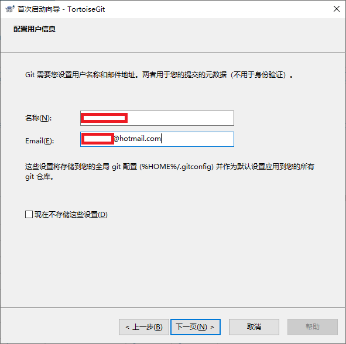
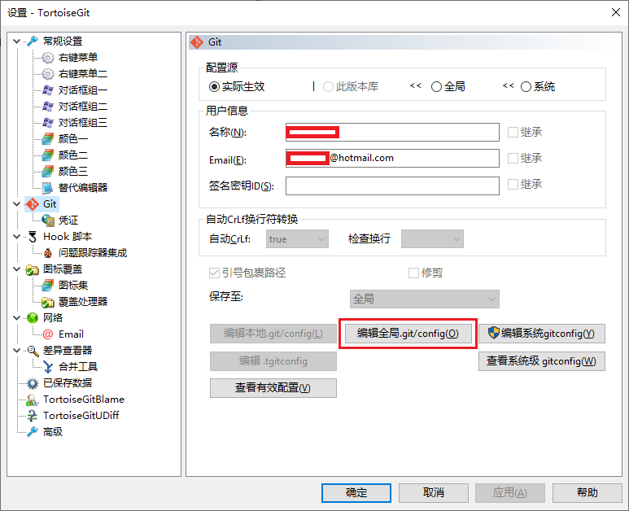

# TortoiseGit应用安装及配置

## 1. 前言

作为一个当前软件开发人员，不可能不知道`Git`。`Git`作为一个复杂的版本控制系统，命令之多，即使经常使用，一些命令也记不住，一般只记住几个常用的命令，不是所有使用`Git`命令行都是高效的。本教程不讲Git命令，而是先让你用上`Git`，再去学习`Git`。本教程应该称作`TortoiseGit`入门指南。因为下面要借助一个图形化的软件，`TortoiseGit`来操作`git`。用GUI（图形界面）再谈CLI（命令行），我相信这会更容易让人接受。  

- 别名：`海龟Git`、`乌龟Git`，我们小组习惯于叫 `小王八`。  
- `TortoiseGit`只能在`Windows`上使用，没有相应的`Linux`版本；不过好在大家搞开发，当前至少还都是使用`Windows`。

## 2. TortoiseGit 简介

- `TortoiseGit` 简称 `tgit`， 中文名`海龟Git`。`TortoiseGit`是一个开放的GIT版本控制系统的源客户端。
- `TortoiseGit` 支持`Winxp/vista/win7/Win10`，提供有中文版支持。
- `TortoiseGit` 可以恢复您的文件的旧版本，并研究如何以及合适改变了历史数据，谁改变了它。下面教程针对使用`TortoiseGit` 的用户。

## 3. 应用下载及安装

`TortoiseGit`是在Git应用基础上的GUI版本，必须在安装Git之后，才能安装`Tortoisegit`。虽然Git自身也带有`Git GUI`，但是其实用性和`TortoiseGit`差距非常大，所以对于技术开发人员来说，强烈建议安装`TortoiseGit`，进行Git仓库的各种管理。确实见到非常喜欢`CLI`的朋友，喜欢命令操作，坚持不用`TortoiseGit`，另当别论。

### 3.1 安装Git

#### 3.1.1 下载安装

- 官方网站下载：

  https://git-scm.com/  
  https://git-scm.com/downloads  
  https://git-scm.com/download/win

- 使用 winget 安装

  ```bash
  winget install --id Git.Git -e --source winget
  ```

#### 3.1.2 Git配置

- 配置如下：

  ```bash
  git config --global user.name "xxx yyyzzz"
  git config --global user.email "yyyzzz_xxx@hotmail.com"
  git config --global credential.helper store
  ```

- 如果是自建Gitlab，使用HTTPS方式的话，需要执行如何指令：

  ```bash
  git config --global http.sslVerify false
  ```

  上述设置会忽略SSL认证，针对不熟悉的服务器，可能会存在问题。如果只是针对自己能够信任的服务器放弃HTTPS，可以通过设置环境变量的方式：

  ```bash
  export GIT_SSL_NO_VERIFY=1
  ```

- Github等有正常SSL证书的网站，如果无法克隆，可能是证书存在问题，重新安装：

  **Linux环境：**

  ```bash
  sudo apt install --reinstall ca-certificates
  ```

  

### 3.2 安装Tortoisegit

#### 3.2.1 应用下载

- 官方网站下载：  
  https://tortoisegit.org/download/  
  语言包也在应用下载的下部。

#### 3.2.2 SSH客户端选择

- 双击开始安装，遇到【SSH客户端选择】画面时：  
  

  ※选择OpenSSH方式，保持和Git一致，不然后续会有不少烦恼。

#### 3.2.3 应用语言选择

- 遇到如下画面的时候，暂停在这里，进行语言包的安装。  
  

  语言包安装接收后，点击Refresh按钮，就可以看到中文简体，选择后，继续安装。  
  也可以在安装结束之后，再安装语言包，然后在setting进行语言包设置。

#### 3.2.4 配置用户信息

- 遇到如下画面是，填写用户信息：  
  

  配置用户信息，因为在Git安装结束之后，已经做了配置，这里不需要做特别的改变，直到安装结束。

## 4. 应用配置

建议采用SSH方式访问云效代码托管平台，所以可以忽略本步骤。

1. 设置数据目录：

   首先，请选定一个存放Git项目的目录，这样方便管理. 如: C:\Gitlab，然后在资源管理器中打开。

2. 启动配置界面：

   在空白处点击鼠标右键，选择 --> TortoiseGit --> Settings，然后就可以看到配置界面。  
   

3. 点击【编辑全局`.git/config`】按钮，把如下内容增加到文件中：

   ```yaml
   [credential]
     helper = store
   ```

   如上设置后，当你使用 HTTPS URL 方式推送项目到GitHub等在线仓库时，海龟git会记住你输入的用户名和密码（这里不是用户的姓名和Email），可以避免每次提交都要输入用户名和密码。（还有种方式，通过使用 SSH URL 来提交代码便可以一劳永逸了~~~）  
   如果你编辑的是 本地 .git/config(L)，其实这个翻译为本地有点问题，应该叫局部，也就是在某个项目下面设置，只对此项目有效，配置是一样的。
   
   如果用指令的话：
   
   ```bash
   git config --global credential.helper store
   ```
   

## 5. 使用示例 - SSH

本地仓库和远程git仓库的连接方式有两种：**HTTPS** 和 **SSH**，很多时候都是直接使用 HTTPS URL 方式克隆项目到本地，当然也有有些人使用SSH URL克隆到本地。这两种方式的主要区别在于：

- **HTTPS**：使用起来不用配置，对初学者来说会比较方便，只要复制HTTPS URL然后到git Bash里面直接用clone命令克隆到本地就好了，但是每次 fetch 和 push代码都需要输入账号和密码，这也是HTTPS 方式的麻烦之处。
- **SSH**：使用SSH URL方式需要在克隆之前先配置和添加好SSH key，因此，如果你想要使用SSH url克隆的话，你必须是这个项目的拥有者。否则你是无法添加SSH key的，另外ssh默认是每次fetch和push代码都不需要输入账号和密码，如果你想要每次都输入账号密码才能进行fetch和push也可以另外进行设置。多数介绍Git的博客里面采用的都是https的方式作为案例，今天主要是记录如何配置并在海龟git中使用SSH方式来提交和克隆代码。

### 5.1 创建SSH密钥

1. 查看SSH密钥

   查看SSH Key。在C盘用户主目录用户目录下，看看有没有.ssh目录，如果有，再看看这个目录下有没有`id_rsa`和`id_rsa.pub`这两个文件，如果已经有了，可以忽略本节内容，跳转到【添加 SSH 密钥到Git 服务器】。

2. 创建SSH密钥   

   如果密钥尚未创建，则需要创建一个SSH Key，在任意文件夹下点击右键，选择 **Git GUI Here**。在弹出的程序中选择主菜单的【Help】→【Show SSH Key】：  
   

   如果没有Key，则点击“Generate Key”生成一个SSH Key：  
     
   
- 如果一切顺利的话，可以在用户主目录里找到`.ssh`目录，里面有`id_rsa`和`id_rsa.pub`两个文件，这两个就是SSH Key的秘钥对，`id_rsa`是私钥，不能泄露出去，`id_rsa.pub`是公钥，可以放心地告诉任何人。（其他创建SSH Key方式：[通过Shell命令方式创建](https://www.liaoxuefeng.com/wiki/0013739516305929606dd18361248578c67b8067c8c017b000/001374385852170d9c7adf13c30429b9660d0eb689dd43a000)）  
  

### 5.2 添加 SSH 密钥到Git 服务器

添加 SSH 密钥到Git 服务器：

  - **GitHub服务器：**登陆GitHub，【头像】→【Settings】→【SSH and GPG Keys】→【New SSH Key】，填入上一步的复制的SSHKey，然后【Add SSH Key】：
  - **Gitlab服务器：**登陆Gitlab，【头像】→【Preferences】→【SSH密钥】→【New SSH Key】，填入上一步的复制的SSHKey，然后【Add SSH Key】

为什么GitHub需要SSH Key呢？因为GitHub需要识别出你推送的提交确实是你推送的，而不是别人冒充的，而Git支持SSH协议，所以，Github只要知道了你的公钥，就可以确认只有你自己才能推送。

### 5.3 取得Git仓库地址

- 要克隆 GitHub 或 Gitlab 上的项目，先要获取对应远程存储库的路径（注意：此处使用 SSH URL 方式）：

    
  个人自建的Gitlab的仓库地址：`git@gitlab.xxx.com:xxx/my-git.git`

### 5.4 克隆Git仓库

- 在本地文件夹的空白位置处，右击鼠标，在菜单中选择【Git克隆】：  
  

  把git 路径填写到URL，并选择本地文件目录，点击【确定】，弹出下载进度窗口。（服务器端至少要有一个文件，否则 pull的时候会报错 fatal: Couldn't find remote ref HEAD）

## 6. 修改 SSH 客户端

### 6.1 使用 GIT 创建的密钥

`ssh-keygen` 创建的密钥，`TortoiseGit` 中不能用。如果配置后 Git Bash 已经可以正常和 GIT 服务器通讯的话，需要把 `TortoiseGit` 的 SSH客户端进行修改。

- `Settings` → `Network` 的右侧画面的 `ssh client` 修改如下：

  ```
  C:\Program Files\Git\usr\bin\ssh.exe
  ```

  ※ 这是 GIT 安装的默认位置，如果 GIT 不是默认安装，请正确找到 GIT 的安装位置。

### 6.2 创建 TortoiseGit 的密钥

`TortoiseGit` 使用扩展名为 `ppk` 的密钥，而不是 `ssh-keygen` 生成的 `rsa` 密钥。

也就是说使用 `ssh-keygen  -t rsa  -C "username@email.com"` 产生的密钥，`TortoiseGit` 中不能用。

而基于`github`的开发必须要用到 `rsa` 密钥，因此需要用到`TortoiseGit`的`putty key generator`工具，来生成既适用于`github`的`rsa`密钥也适用于`TortoiseGit`的`ppk`密钥。

以下是生成`ppk`密钥，并且在`TortoiseGit`中设置的步骤：

1. 始程序菜单中，打开TortoiseGit，点击 PuTTYgen，在打开的窗口中点击Generate按钮，会出现绿色进度条，生成过程中可以多晃晃鼠标增加随机性。

2. 生成之后复制生成的全部内容，窗口先留着不关闭。

3. 在 代码管理网站，如github、码云。这里拿码云为例。布局都差不多。

   点击右上角，修改资料——点击左侧的 ssh公钥——填写右侧的添加公钥——标题自拟，把第二步复制的代码粘贴到下面的公钥那里——点击确定。

4. 返回到第二步的窗口，点击 **Save private key**  按钮保存为适用于TortoiseGit的私钥，扩展名为.ppk。

5. 运行TortoiseGit开始菜单中的Pageant程序，程序启动后将自动停靠在任务栏中，双击该图标，弹出key管理列表。

6. 在弹出的key管理列表中，点击add key,将第4步中保存的私钥（.ppk）文件加进来，关闭对话框即可。

7. 回到项目目录下，右键——TortoiseGit——Settings——点击Remote，将第4步中保存的私钥（.ppk）文件加进来。

   注意URL后面填的是 git仓库的 ssh地址。

   完成后，右键可以直接pull和push操作了。

### 6.3 补充：

如果一开始是用git命令（ ssh-keygen   -t   rsa   -C   [邮箱] ），生成的公钥和密钥（ 比如 id_rsa 和 id_rsa.pub ）

首先，把生成的公钥粘贴到 git远程仓库管理中心。接下来用ssh的方式连接远程仓库。

有两种操作方式：

1. 用 git命令

   可以直接用命令“git  pull【仓库的ssh地址】【分支名称】”   这样拉取和推送

2. 用 TortoiseGit 方式

   需要将私钥转成 .ppk格式

　　1）运行PuTTYgen，在Conversions菜单中点击Import key，选择一开始生成的私钥文件，比如 id_rsa文件。

　　2）点击Save private key 按钮，将其保存为.ppk文件。

　　3）打开Pageant，点击Add Key，选择前一步所保存的.ppk文件所在的位置即可。

　　PuTTYGen 和 Pageant 都在开始菜单中的TortoiseGit文件夹下，可以找到。
