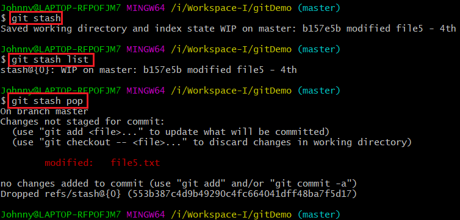
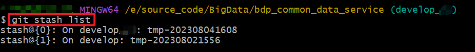

# Git 指令详解 `git reset`

## 1. 回退/撤销

- 撤销到远程仓库(PUSH)或本地仓库(COMMIT)的最新最近一次的正式版本

  时常有这样一种场景，不小心改动了部分文件，或修改了部分文件却发现无用，此时可能还没有`git push`，也可能`push`了；又可能`commit`了，或者还没有`commit`。
  此时，我们想撤销(`git reset`)到远程仓库或本地仓库的最新最近一次的正式版本中来。
  
- 工作中最常用的指令组合

  撤销最后一次提交：

  ```bash
  git reset --hard HEAD^
  git push -f origin HEAD
  ```

  撤销最后一次提交，并且强制推送到远程仓库。
  
- 无法直接合并的分支，可以按照 `commit-id` 逐个导入：

  ```bash
  git cherry-pick -x <commit-id>
  ## 例如，commit-id 是 5dd4cc80006a7edb2e4a92a81780de8d91c48b27 的情况的拷贝
  git cherry-pick -x 5dd4cc80006a7edb2e4a92a81780de8d91c48b27
  ```

  

### 1.1 回退到指定版本

- 回退到最近一次的COMMIT版本

  指令 `git reset --hard <HEAD/CommitId/Tag>`

  ```bash
  git reset --hard HEAD
  ```

  回退到最近一次的COMMIT版本上（即 【当前版本/撤销到倒数第1个COMMIT版本】）；将工作区、暂存区和HEAD保持一致。

- 回退到上一次的COMMIT版本

  指令 `git reset --hard HEAD~1`  或 `git reset --hard HEAD^`，这个较为**常用**，主要是撤回已经提交的最好一个版本。

  ```bash
  git reset --hard HEAD~1
  git reset --hard HEAD^
  ```

  回退到上一次的COMMIT版本上（即 【上一版本/撤销到倒数第2个COMMIT版本】）；将工作区、暂存区和HEAD保持一致。

- 回退到上上次的COMMIT版本

  指令 `git reset --hard HEAD~2` 或 `git reset --hard HEAD^^`

  ```bash
  git reset --hard HEAD~2
  git reset --hard HEAD^^
  ```

  回退到上上次的COMMIT版本上（即 【上上版本/撤销到倒数第3个COMMIT版本】）；将工作区、暂存区和HEAD保持一致。

- 回退到指定的COMMIT版本

  ```bash
  git reset --hard HEAD~99
  git reset --hard HEAD^...^(99个'^')
  ```

  回退到上上次的COMMIT版本上（即 【撤销到倒数第100个COMMIT版本】）；将工作区、暂存区和HEAD保持一致。

### 1.2 撤销本地修改

- 指令：

  ```bash
  git reset HEAD
  ```

  将暂存区和HEAD的提交保持一致。

  基本用不到该指令，用 `TortiseGit` 界面 `revert` 操作，更为简单、便捷。

### 1.3 覆盖本地改动

- 指令：

  ```bash
  git checkout <filename/branch/tag>
  ```

  替换/覆盖本地改动。

  将使用HEAD指针所指的最新内容替换工作目录中的文件；已添加到暂存区(含：新建文件)的改动不会受影响[git add -A xx 以后]。

### 1.4 丢弃本地所有改动

丢弃在本地的所有改动与提交(commit)，可到服务器上获取最新的版本。

- 指令：

  ```bash
  git fetch origin
  git reset --hard origin/<remoteBranchName>
  ```


## 2. 回撤本地提交代码

`git reset --hard <commitId> | git reset --soft<commitId>`

两种方式：不清除本地提交、清除本地提交

### 2.1 回退并清除本地提交

回退到上次提交，并清除本地提交的代码 | 本地仓库的本地代码回退到指定的远程仓库版本

1. 查看提交日志记录

   ```bash
   git log
   ```

2. 回退本地仓库的本地分支到指定版本

   ```bash
   git reset --hard <HEAD/commitId/branch/tag>
   ```

3. 强制推送到远程仓库的分支 `[可选步骤]` 

   指令：`git push origin <HEAD/commitId/branch/tag> --force`

   ```bash
   git push -f
   git push -f origin HEAD
   ```

### 2.2 回退不清除本地提交

> 回退到上次提交，不清除本地提交的代码

例如：在main分支写了半天，然后 `git commit` 提交了 ，才发现 在 `main` 分支开发的。或者是重新整理 Commit 内容的时候，比较有用。


1. 查看提交日志记录

   ```bash
   git log
   ```

2. 回退到上次提交，不清除本地提交的代码

   指令：`git reset --soft <HEAD/commitId/branch/tag>`

   ```bash
   git reset --soft HEAD
   ```

   这样，刚刚提交的就又回到本地的`local changes`列表中。

3. 强制推送到远程仓库的分支 `[可选步骤]`

   指令：` git push origin <HEAD/commitId/branch/tag> --force`

   ```bash
   git push -f
   ```

   

## 3. 回撤到指定旧版本

这属于极端情况，很少能够用到。

- 指令

  ```bash
  # 暂存本地仓库的变化
  git stash save
  
  # 回撤本地仓库到旧版本
  git reset --hard {oldCommitId}
  
  # 强制提交并修改远程仓库到旧版本
  git push origin HEAD --force
  ```

- git stash

  在`git reset`回退操作前，如果你修改的有效内容较多时(避免白干活...)，可尝试使用此命令解决。在`git reset`后，再`git stash pop`即可还原先前的修改内容。  
    
    
  

  
