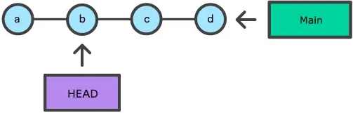
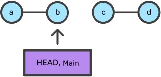

# Git作业仓库

- Git 内部的三颗树 / Git's three trees

  为了更好的理解 git reset 的作用，我们首先得理解Git内部的状态管理机制。一般来说，这些机制会被称为"Git's three trees"，也就是Git的三颗树。说树可能不太准确，因为他们并不是传统意义上的树的数据结构，而是基于节点和指针的数据结构。为了更好的说明这些机制，我们来新建一个Git仓库并做一些变更来观察这三颗”树“的变化。

  ```
  $ mkdir git_reset_test
  $ cd git_reset_test/
  $ git init .
  Initialized empty Git repository in /git_reset_test/.git/
  $ touch reset_lifecycle_file
  $ git add reset_lifecycle_file
  $ git commit -m"initial commit"
  [main (root-commit) d386d86] initial commit
  1 file changed, 0 insertions(+), 0 deletions(-)
  create mode 100644 reset_lifecycle_file
  ```

  上面的例子中我们新建了一个仓库，并且添加了一个 reset_lifecycle_file 文件。此时，仓库有一个commit，commit的hash值是d386d86，内容是增加了 reset_lifecycle_file 文件。

## 1. 工作目录 `The working directory`

- 首先我们来查看的”树“是工作目录，工作目录与本地文件系统同步，代表对文件和目录中的内容所做的即时更改。

  ```bash
  $ echo 'hello git reset' > reset_lifecycle_file
   $ git status 
   On branch main
   Changes not staged for commit: 
   (use "git add ..." to update what will be committed) 
   (use "git checkout -- ..." to discard changes in working directory) 
   modified: reset_lifecycle_file
  ```

  在我们的demo仓库中，我们更改了 reset_lifecycle_file 文件，然后执行 git status 查看文件的变更。这些变更就是工作目录的一部分。`git status` 命令可以用于展示工作目录的改变。

## 2. 暂存索引 `Staging Index`

下一颗介绍的”树“树是暂存索引，暂存索引追踪从工作目录通过 git add 命令添加的变更，这些变更将被用于下一次提交(commit)。暂存索引是Git内部一个复杂的缓存机制。通常来讲，Git会对用户隐藏暂存索引的实现。但是为了更加直接的观察到暂存索引的状态 。

- 我们可以使用一个”鲜为人知的Git命令 `git ls-files -s`

  ```bash
  git ls-files -s
  100644 e69de29bb2d1d6434b8b29ae775ad8c2e48c5391 0   reset_lifecycle_file
  ```

  这里我们执行了 git ls-files -s(--stage)。如果不加-s / --stage 选项的话，git ls-files的输出只是文件的名字和路径，`-s / --stage` 选项可以为我们展示更多的在暂存索引里文件的元数据。这些元数据有暂存内容的`mode`，`object name`，还有`stage number`。这里我们更关心 `object name`，也就是第二个值(`e69de29bb2d1d6434b8b29ae775ad8c2e48c5391`)。这是一个标准的 Git 对象 `SHA-1` 哈希值，在这里他代表了文件的哈希。`Commit History` 存储它自己的对象 SHA，用于识别指向`commit`和`ref`的指针，而暂存索引具有自己的对象 SHA，用于跟踪索引中文件的版本。

- 接下来，我们把 reset_lifecycle_file 添加进暂存索引

  ```bash
  $ git add reset_lifecycle_file 
  $ git status 
  On branch main Changes to be committed: 
  (use "git reset HEAD ..." to unstage) 
  modified: reset_lifecycle_file
  ```

  这里我们通过 git add 把 `reset_lifecycle_file` 加入了暂存索引并使用 `git status` 查看状态。这里有很重要的一点，`git status` 并不是直接展示暂存索引的状态，而是暂存索引和`Commit History`之间的变更。

- 让我们来看看现在暂存索引长啥样

  ```bash
  $ git ls-files -s 100644 d7d77c1b04b5edd5acfc85de0b592449e5303770 0 reset_lifecycle_file
  ```

  可以看到 `reset_lifecycle_file` 的对象 `SHA` 从 `e69de29bb2d1d6434b8b29ae775ad8c2e48c5391` 变为了 `d7d77c1b04b5edd5acfc85de0b592449e5303770`。

## 3. 提交历史 `Commit history`

最后一颗要介绍的`”树“`就是`提交历史 / Commit history`。`git commit` 命令用于把变更存入一个在提交历史中永久的快照里，此快照还包括提交时暂存索引的状态。

- 指令：

  ```bash
  $ git commit -am"update content of reset_lifecycle_file"
  [main dc67808] update content of reset_lifecycle_file
  1 file changed, 1 insertion(+)
  $ git status
  On branch main
  nothing to commit, working tree clean
  ```

  在这里，我们创建了一个带有 `update content of reset_lifecycle_file` 的消息的新提交。 变更集已经添加到提交历史中。 此时调用 `git status` 可以看到暂存索引和工作目录中都没有待提交的更改了。 执行 `git log` 将显示 `Commit History`。 现在我们已经通过三棵树跟踪了这个变更，我们可以开始使用 `git reset`啦。

## 4. 撤销指令 `git reset` 

表面上来看，`git reset` 和 `git checkout` 有着类似的表现。但是 `git checkout` 仅仅只是改变 `HEAD` 的指针，`git reset` 会同时移动 `HEAD` 和 当前分支的指针，为了更好的理解这个表现让我们来看下面的例子。

- 作业目录情况：  
   
  这个例子中，`main`分支上有一些提交，`HEAD` 和 当前分支的引用都指向 `commit d`，现在让我们来比较一下`git checkout b` 和 `git reset b` 的区别。

- `git checkout b`  
    
  在执行完`git checkout b` 后，`HEAD`引用指向 `commit b`，但是当前分支的引用仍然指向 `commit d`，这个仓库目前处于一个`头部分离的状态`(detached HEAD)。

- git reset b  
    
  不同于 `git checkout b`，`git reset b` 同时改变了`HEAD`引用和当前分支的引用。除此之外，`git reset` 会改变`Git`三棵树的状态。在`Commit tree`上的`ref`改变总是会发生的，但是暂存索引和工作目录如何改改变由命令行选项 `--soft`， `--hard`，`--mixe`d 直接决定。

## 5. 撤销选项 `Main Options`

默认执行 git reset 时会隐含两个参数 `--mixed HEAD`，这意味着 `git reset` 和 `git reset --mixed HEAD` 是等价的。这里`HEAD`是指定要`reset`的`commit`。除了`HEAD`，任意 `Git SHA-1 commit哈希`都可以在这里使用。

### --hard

 `--hard`是最直接，最危险，同时也是`使用最频繁`的选项。当我们传入 `--hard` 执行 `git reset` 时，`Commit History`会被更新到指定的`commit`，同时暂存索引和工作目录也会被重置到对应`commit`的状态。这意味着，指定你工作目录和暂存索引里的内容会丢失。

- 为了证明这点，我们继续用上面的`demo`举例。

  ```bash
  $ echo 'new file content' > new_file
  $ git add new_file
  $ echo 'changed content' >> reset_lifecycle_file
  ```

  我们添加了一个新文件 new_file 并把它添加进了仓库，并且也修改了 reset_lifecycle_file 文件。有了这些变更，

- 我们用 git status 来看看仓库的状态。

  ```bash
  $ git status
  On branch main
  Changes to be committed:
     (use "git reset HEAD ..." to unstage)
  
  new file: new_file
  
  Changes not staged for commit:
     (use "git add ..." to update what will be committed)
     (use "git checkout -- ..." to discard changes in working directory)
  
  modified: reset_lifecycle_file
  ```

  我们可以看到此时仓库里有待暂存和待提交的变更。

- 在接下去之前，我们先看看暂存索引的状态。

  ```
  $ git ls-files -s
  100644 8e66654a5477b1bf4765946147c49509a431f963 0 new_file
  100644 d7d77c1b04b5edd5acfc85de0b592449e5303770 0 reset_lifecycle_file
  ```

  我们可以看到 new_file 被添加进了索引中，但是 reset_lifecycle_file 的hash值没变。这正是我们期望的表现，因为我们还没有把 reset_lifecycle_file 的变更提交到暂存索引中。

- 接下来我们执行 git reset --hard 并查看仓库的新状态。

  ```bash
  $ git reset --hard
  HEAD is now at dc67808 update content of reset_lifecycle_file
  $ git status
  On branch main
  nothing to commit, working tree clean
  $ git ls-files -s
  100644 d7d77c1b04b5edd5acfc85de0b592449e5303770 0 reset_lifecycle_file
  ```

这里我们通过 `--hard` 选项执行了一次 `硬重置` ，Git的输出表明`HEAD`当前指向最新的提交 `dc67808`。随后我们使用 `git status` 查看仓库状态，Git显示当前工作目录没有待暂存的文件。最后我们执行了 `git ls-files -s` 查看了暂存索引的状态，我们发现指针回到了`new_file` 被添加之前的状态。由此可见，我们新增的 `new_file`文件和修改的`reset_lifecycle_file` 文件都被摧毁了。**这些数据的丢失是不可逆转的，这是要特别注意的点。**

### --mixed

`--mixed` 是默认的选项。这种模式下，引用指针会更新。暂存索引被重置到指定commit的状态，任何暂存索引未提交的变更都会被移动到工作目录中。

- 继续上面的例子

  ```bash
  $ echo 'new file content' > new_file
  $ git add new_file
  $ echo 'append content' >> reset_lifecycle_file
  $ git add reset_lifecycle_file
  $ git status
  On branch main
  Changes to be committed:
      (use "git reset HEAD ..." to unstage)
  
  new file: new_file
  modified: reset_lifecycle_file
  
  $ git ls-files -s
  100644 8e66654a5477b1bf4765946147c49509a431f963 0 new_file
  100644 7ab362db063f9e9426901092c00a3394b4bec53d 0 reset_lifecycle_file
  ```

  在上面的示例中，我们对仓库进行了一些修改。 同样的，我们添加了一个 `new_file` 并修改了 `reset_lifecycle_file` 的内容。 然后使用 `git add` 将这些更改应用于暂存索引。 

- 随着 `repo` 处于这种状态，我们现在将执行git reset。

  ```bash
  $ git reset --mixed
  $ git status
  On branch main
  Changes not staged for commit:
      (use "git add ..." to update what will be committed)
      (use "git checkout -- ..." to discard changes in working directory)
  
  modified: reset_lifecycle_file
  
  Untracked files:
      (use "git add ..." to include in what will be committed)
  
  new_file
  
  no changes added to commit (use "git add" and/or "git commit -a")
  $ git ls-files -s
  100644 d7d77c1b04b5edd5acfc85de0b592449e5303770 0 reset_lifecycle_file
  ```

  在这里，我们执行了 `git reset --mixed`。 重申一下，`--mixed` 是默认模式，与执行 `git reset` 的效果相同。 检查 `git status` 和 `git ls-files` 的输出，显示暂存索引已重置为 `reset_lifecycle_file` 是索引中唯一文件的状态。 `reset_lifecycle_file` 的对象 SHA 已重置为以前的版本。

这里需要注意的重要一点是 `git status` 向我们显示了对 `reset_lifecycle_file` 的修改，并且有一个未跟踪的文件：`new_file`。 这符合 `--mixed` 行为。 暂存索引已重置，未提交的更改已移至工作目录。 将此与 `--hard reset` 案例进行比较，`--hard`中暂存索引已重置，工作目录也被重置，导致我们直接丢失了这些变更。

### --soft

当 我们传递--soft 选项时，引用指针被更新， 暂存索引和工作目录保持不变。 这种行为很难清楚地展示。

- 继续我们的上面的 `demo`

  ```bash
  $ git add reset_lifecycle_file 
  
  $ git ls-files -s 
  
  100644 67cc52710639e5da6b515416fd779d0741e3762e 0 reset_lifecycle_file 
  
  $ git status 
  
  On branch main
  
  Changes to be committed: 
  
  (use "git reset HEAD ..." to unstage) 
  
  modified: reset_lifecycle_file 
  
  Untracked files: 
  
  (use "git add ..." to include in what will be committed) 
  
  new_file
  ```

  这里我们再次使用 `git add` 将修改后的 `reset_lifecycle_file` 提交到暂存索引中。 通过 `git ls-files` 的输出我们确认了暂存索引已经进行了更新。 我们之前示例中的 `new_file` 作为未跟踪文件在工作目录中出现。 我们执行 `rm new_file` 来删除文件，因为我们在接下来的示例中不需要它。

- 撤销修改

  ```bash
  $ git reset --soft
  $ git status
  On branch main
  Changes to be committed:
      (use "git reset HEAD ..." to unstage)
  
  modified: reset_lifecycle_file
  $ git ls-files -s
  100644 67cc52710639e5da6b515416fd779d0741e3762e 0 reset_lifecycle_file
  ```

  可以看到，我们执行了 `git reset --soft` 。 使用 `git status` 和 `git ls-files` 检查仓库状态发现没有任何变化，这正是预期的行为。 软重置只会重置`Commit History`。 默认情况下，使用 `HEAD` 作为目标提交调用 `git reset` 。 同时由于此时我们的 `Commit History` 已经在 `HEAD` 上，所以我们隐式地重置为 `HEAD` 并没有发生任何事情。

- 为了更好地理解和利用 --soft 我们需要一个不是 HEAD 的目标提交。 我们在暂存索引中有 reset_lifecycle_file 可以提交。

  ```bash
  $ git commit -m "prepend content to reset_lifecycle_file"
  ```

- 此时，我们的仓库应该有三个提交，我们将回到第一次提交。 为此，我们需要第一个提交的 ID。 可以执行 git log 来查找该ID。

  ```bash
  $ git log
  commit 62e793f6941c7e0d4ad9a1345a175fe8f45cb9df
  Author: bitbucket 
  Date: Fri Dec 1 15:03:07 2017 -0800
  prepend content to reset_lifecycle_file
  
  commit dc67808a6da9f0dec51ed16d3d8823f28e1a72a
  Author: bitbucket 
  Date: Fri Dec 1 10:21:57 2017 -0800
  
  update content of reset_lifecycle_file
  
  commit 780411da3b47117270c0e3a8d5dcfd11d28d04a4
  
  Author: bitbucket 
  Date: Thu Nov 30 16:50:39 2017 -0800
  
  initial commit
  ```

  通过上面的命令，我们找到了第一个提交的ID `780411da3b47117270c0e3a8d5dcfd11d28d04a4`。

- 在我们回去之前，我们先看看暂存索引中的状态。

  ```bash
  $ git status && git ls-files -s
  On branch main
  nothing to commit, working tree clean
  100644 67cc52710639e5da6b515416fd779d0741e3762e 0 reset_lifecycle_file
  ```

  在这里，我们执行 `git status` 和 `git ls-files -s` 的组合命令，输出表明我们在仓库中有`待暂存` / `待提交`的更改，并且暂存索引中的 `reset_lifecycle_file` 的版本为 `67cc52710639e5da6b515416fd779d0741e3762e`。 

- 现在让我们执行`git reset --soft` 回到我们的第一次提交。

  ```bash
  $git reset --soft 780411da3b47117270c0e3a8d5dcfd11d28d04a4
  $ git status && git ls-files -s
  On branch main
  Changes to be committed:
      (use "git reset HEAD ..." to unstage)
  
  modified: reset_lifecycle_file
  100644 67cc52710639e5da6b515416fd779d0741e3762e 0 reset_lifecycle_file
  ```

  上面的代码执行“git reset --soft”，还调用了 `git status` 和 `git ls-files` 组合命令用于输出仓库的状态。 我们可以检查仓库状态并且注意到一些有趣的结果。 首先， `git status` 表明对 `reset_lifecycle_file` 有修改，说明他们可以被提交到暂存索引。 其次， `git ls-files` 输入表明暂存索引没有改变，并保留了我们之前的 SHA `67cc52710639e5da6b515416fd779d0741e3762e`。

- 为了进一步说明 git reset 做了什么，我们执行 `git log`

  ```bash
  $ git log 
  commit 780411da3b47117270c0e3a8d5dcfd11d28d04a4 Author: bitbucket  Date: Thu Nov 30 16:50:39 2017 -0800 initial commit
  ```

  输出显示提交历史记录中只有一个提交。 这清楚地说明 `--soft` 做了什么。

  这可能会令人困惑，为什么 `git status` 表明有修改过的文件。 `--soft` 不会触及暂存索引，因此我们的暂存索引的更新会在提交历史记录中及时跟踪我们。 这可以通过 `git ls-files -s` 的输出来确认，显示 `reset_lifecycle_file` 的 SHA 未更改。 提醒一下， `git status` 不显示“Git三棵树”的状态，它本质上显示了它们之间的差异。 在这种情况下，它显示暂存索引领先于提交历史中的更改，就好像我们已经暂存它们一样。